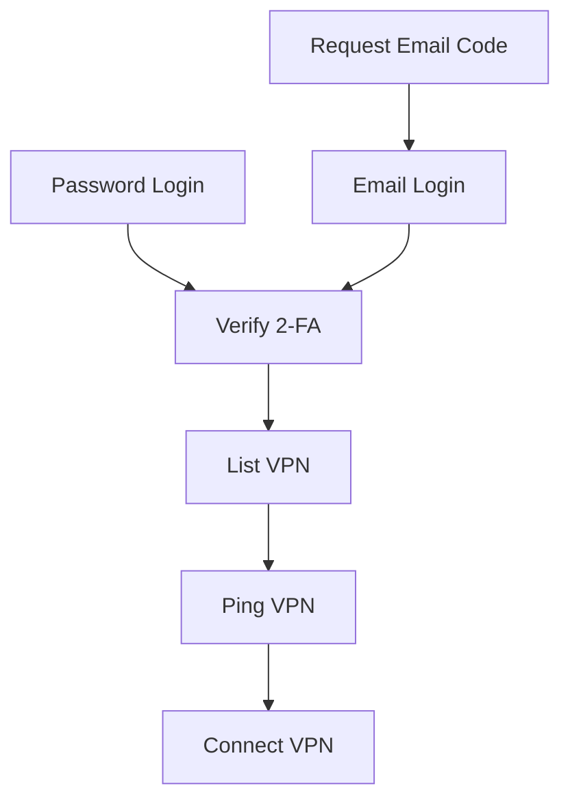
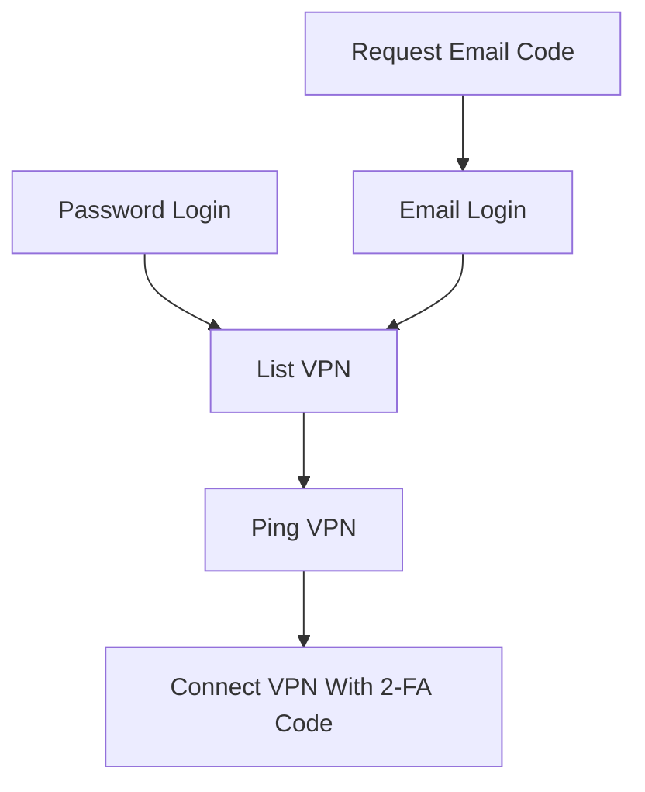

# corplink-rs

使用 rust 实现的 [飞连][1] 客户端，支持 Linux/Windows10/MacOS

# 安装

## ArchLinux

下载 [release](https://github.com/PinkD/corplink-rs/releases) 中的安装包，并安装

```bash
pacman -U corplink-rs-4.1-1-x86_64.pkg.tar.zst
```

> 欢迎贡献其它包管理器的打包脚本

## 手动编译

### linux/macos

```bash
git clone https://github.com/PinkD/corplink-rs --depth 1
cd corplink-rs
# build libwg
cd libwg
./build.sh
cd ..
# if you are using Windows, you can clone and build libwg manually
# ref: wireguard-go/Makefile:libwg

cargo build --release
# install corplink-rs to your PATH
sudo install -Dm 755 target/release/corplink-rs /usr/bin/corplink-rs
```

### windows

**前提**: 需要 Go (≥1.22)、GCC (MinGW-w64)、make、Rust (GNU 工具链)。

安装工具链后，在 **PowerShell** 中执行：

```powershell
# 1. 构建 libwg（生成 libwg.a + libwg.h）
cd libwg
.\build.ps1

# 2. 构建 Rust 项目
cd ..
rustup toolchain install stable-gnu
rustup default stable-x86_64-pc-windows-gnu
cargo build --release
```

> 编译的 `build.ps1` 会调用 `make libwg`，该目标会以 `CGO_ENABLED=1` 编译 Go 代码。
> MinGW GCC 需要在 PATH 中，且 make 需要支持 bash 风格环境变量语法。
> 也可在 MSYS2 UCRT64 环境中执行 `./build.sh`（同样需要 Go + GCC）。

# 用法

> **该程序需要 root 权限来启动 `wg-go` (windows 上需要管理员权限)**

```bash
# direct
corplink-rs config.json
# systemd
# config is /etc/corplink/config.json
systemctl start corplink-rs.service
# auto start
systemctl enable corplink-rs.service

# systemd with custom config
# config is /etc/corplink/test.json
# NOTE: cookies.json is reserved by cookie storage
systemctl start corplink-rs@test.service
```

## 白名单流量接管

如果要让 GitHub、Redshift 等有 IP 白名单限制的公网服务走公司 VPN，推荐使用 `managed_routes`。它会在启动前把目标服务解析成 IP/CIDR，合入 WireGuard `AllowedIPs` 和系统路由；不会改写包含密码、cookie、TOTP、WireGuard key 的主配置。

### 脚本关系与推荐入口

```bash
scripts/corplink-traffic.sh start
```

日常只需要维护 `config.local.json`，把 GitHub 和 Redshift endpoint 都写进 `managed_routes.sources`，然后直接运行 `scripts/corplink-traffic.sh start`。脚本会自己解析目标、安装路由并选择一个检查目标等待就绪。

`scripts/corplink-traffic.sh` 是主入口，负责启动进程、解析 managed routes、检查系统路由、测试 GitHub/Redshift 这类白名单目标。

`scripts/corplink-github.sh` 是 GitHub 场景的兼容 wrapper，只做一件事：把检查目标固定为 `github.com`，然后原样转发到 `scripts/corplink-traffic.sh`。新用法优先直接使用 `corplink-traffic.sh`。

```bash
scripts/corplink-github.sh status
```

`scripts/update-managed-routes.py` 是解析工具，通常由 `corplink-traffic.sh preflight/start/status` 间接调用。只有在你想单独检查 managed routes 解析结果时才需要直接运行它。

`scripts/corplink-traffic.sh start` 会做三件事：

- 读取 `config.local.json`（也可以用 `CORPLINK_CONFIG=/path/to/config.json` 指定其它配置文件）。
- 如果 `target/release/corplink-rs` 不存在，自动执行 `cargo build --release`。
- 用 `sudo` 后台启动 `corplink-rs`，并等待检查目标路由走到配置里的 `interface_name`。检查目标会从 `managed_routes` 自动推导：优先使用 `github_meta` 对应的 `github.com`，否则使用第一个 `dns_hosts` host。日志写入 `.run/corplink-traffic.log`。

本机需要有 `git`、`python3`、Rust/Cargo、Go、`make`、`clang`/libclang、`route`、`ifconfig`、`sudo`。测试 GitHub 时需要已经配置好能访问目标仓库的 SSH key；测试 Redshift 端口时需要本机有 `nc`。

首次使用前需要先准备 `libwg`：

```bash
cd libwg
./build.sh
cd ..
```

然后从模板创建本机配置：

```bash
cp config.template.json config.local.json
```

`config.template.json` 是可提交模板；`config.local.json` 是本机真实配置，已经被 `.gitignore` 忽略，不应该提交。模板已经包含 GitHub 和 Redshift 的 managed routes，只需要把公司、账号、密码和 Redshift endpoint 换成自己的值；如果暂时不用 Redshift，就删除 `redshift-prod` 这一段 source：

```json
{
  "company_name": "company code name",
  "username": "your_name",
  "password": "your_real_password",
  "platform": "feilian",
  "interface_name": "utun12345",
  "use_vpn_dns": false,
  "auto_setup_routes": true,
  "route_mode": "split",
  "vpn_select_strategy": "latency",
  "managed_routes": {
    "enabled": true,
    "stale_ttl_secs": 86400,
    "include_ipv6": false,
    "cache_file": ".run/managed-routes-cache.json",
    "sources": [
      {
        "name": "github",
        "type": "github_meta",
        "keys": ["web", "api", "git"]
      },
      {
        "name": "redshift-prod",
        "type": "dns_hosts",
        "hosts": ["your-cluster.region.redshift.amazonaws.com"],
        "port": 5439
      }
    ]
  }
}
```

`platform` 和 `password` 的关系：

- `platform: "feilian"`：`password` 可以填真实密码；客户端会在登录前自动转成 sha256。也支持直接填 64 位 sha256 hex。
- `platform: "ldap"`：`password` 必须填真实 LDAP 密码；客户端不会做 sha256。
- 如果公司环境只允许 LDAP 登录，把模板里的 `platform` 改成 `ldap`，`password` 仍然填真实密码。
- 不建议用 `lark` / `OIDC` 配合 `start` 做首次登录，因为 `start` 是后台启动，扫码、邮箱验证码等交互流程不方便处理。需要交互排障时用 `foreground`。

不要把自己的 `config.local.json` 原样发给同事。下面这些字段和文件是本机状态或个人凭据，每个人都应该自己生成：

- `code`：登录后保存的 TOTP secret。
- `state`：本地登录状态。
- `device_id` / `device_name`：本机设备标识；不填时会自动生成默认值。
- `public_key` / `private_key`：本机 WireGuard key pair；不填时首次运行会自动生成。
- `*_cookies.json`：本地 cookie 文件。

### 日常使用方式

正常使用时优先走 `corplink-traffic.sh`：

```bash
scripts/corplink-traffic.sh start       # 后台启动，等待默认检查目标路由就绪
scripts/corplink-traffic.sh status      # 查看进程、接口、检查目标路由和 managed source 摘要
scripts/corplink-traffic.sh test-host   # 测试默认检查目标的路由；需要测 TCP 端口时加 TEST_PORT=5439
scripts/corplink-traffic.sh restart     # 修改 config.local.json 后重启刷新路由
scripts/corplink-traffic.sh logs        # 查看最近日志
scripts/corplink-traffic.sh logs -f     # 跟随日志
scripts/corplink-traffic.sh stop        # 停止后台进程
```

GitHub repo 访问测试需要显式传入要检查的仓库；脚本不内置默认仓库：

```bash
TEST_REPO=git@github.com:owner/repo.git scripts/corplink-traffic.sh test
```

Redshift 端口测试。`dns_hosts` source 已经配置 `port: 5439` 时，不需要再写 host：

```bash
TEST_PORT=5439 scripts/corplink-traffic.sh test-host
```

`TEST_HOST` 不是配置项，只是临时排查用的覆盖值。只有当你想临时检查一个没有写进 `managed_routes` 的目标时才需要它：

```bash
TEST_HOST=other.example.com TEST_PORT=443 scripts/corplink-traffic.sh test-host
```

常用环境变量：

```bash
CORPLINK_CONFIG=/path/to/config.json scripts/corplink-traffic.sh start
CORPLINK_BIN=/path/to/corplink-rs scripts/corplink-traffic.sh start
RUST_LOG=debug scripts/corplink-traffic.sh foreground
```

Redshift 需要填写具体 cluster/workgroup endpoint。`dns_hosts` 会用 DNS-over-HTTPS 解析真实 A/AAAA 记录，避免本机 Surge fake-IP DNS 返回 `198.18.0.0/15` 假地址。`DOMAIN-SUFFIX,redshift.amazonaws.com,"🏢 公司网络"` 这类 Surge 规则只能做应用层分流；真正让流量走公司出口的是 `managed_routes` 解析出的 IP route。不要把 AWS 全量 IP ranges 加进 VPN，除非你明确希望接管其它 AWS 流量。

`managed_routes` 的解析结果会写入 `.run/managed-routes-cache.json`。当某个 source 临时解析失败时，未超过 `stale_ttl_secs` 且 source 输入完全匹配的旧结果会继续使用；首次启动且没有可用 cache 时会失败并指出具体 source。当前 `wg-corplink` 的系统 route UAPI 只支持添加 route，不支持删除旧 route，因此 managed routes 在启动时解析，目标 IP 变化后需要重启进程刷新。

如果只想检查解析结果，不要使用会输出整份配置的旧脚本，使用：

```bash
scripts/update-managed-routes.py config.local.json --dry-run
```

`--dry-run` 只打印解析结果，不写 `.run/managed-routes-cache.json`；需要预先刷新 cache 时显式加 `--write-cache`。

## windows 使用说明

### 快速开始（推荐使用预编译版本）

1. 从 [Releases](https://github.com/PinkD/corplink-rs/releases) 下载 `corplink-rs-*-windows.zip`
2. 解压到任意目录
3. 运行 `setup.ps1` 自动获取 `wintun.dll`：

```powershell
powershell -ExecutionPolicy Bypass -File setup.ps1
```

4. 编辑 `config.json`，填入公司代码和登录信息（见下方配置文件实例）
5. 以**管理员身份**打开 PowerShell，运行：

```powershell
.\corplink-rs.exe config.json

# 调试模式
$env:RUST_LOG="debug"; .\corplink-rs.exe config.json
```

### wintun.dll 说明

`corplink-rs` 依赖 [Wintun][6] 虚拟网卡驱动来创建 WireGuard 隧道。由于 Wintun 的许可证要求用户从[官网][6]直接获取，我们无法在 release 包中附带该文件。

`setup.ps1` 脚本会自动从 `wintun.net` 下载并解压 `amd64` 版本的 `wintun.dll` 到当前目录。

手动获取：访问 [wintun.net][6]，下载 zip 包，将 `bin/amd64/wintun.dll` 复制到 `corplink-rs.exe` 所在目录。

### 管理员权限

程序需要管理员权限，原因：
- `wg-go` 需要创建 TUN 虚拟网卡
- 配置系统路由表（自动添加 VPN 路由）

如果运行时提示 `please run as administrator`，右键 PowerShell 选择"以管理员身份运行"。

### 常见问题

- **wintun.dll 找不到**：运行 `setup.ps1` 或手动下载放入同目录
- **配置文件 JSON 不支持注释**：示例中的 `// comment` 需要删除
- **路由未生效**：检查是否以管理员运行，关闭其他 VPN 软件避免路由冲突

## macos 特殊说明

macos 要求 tun 设备的名称满足正则表达式 `utun[0-9]*` ，因此需要将配置文件中的 `interface_name` 改为符合正则的名字，例如 `utun12345`  
另外， `utun` 后的数字类型应该是 `int16` ，如果大于 `32767` 会报错 `Failed to create TUN device: invalid argument` 。具体参考 [#46](https://github.com/PinkD/corplink-rs/issues/46)

## log level 配置

本项目使用 [env_logger](https://docs.rs/env_logger/latest/env_logger/) 作为 log 库，修改 log level 需要使用环境变量，示例：

```bash
RUST_LOG=debug ./corplink-rs config.json
```

# 配置文件实例

最小配置

```json
{
  "company_name": "company code name",
  "username": "your_name"
}
```

推荐配置(自用配置)

```json
{
  "company_name": "company code name",
  "username": "your_name",
  "password": "your_real_password",
  "platform": "feilian"
}
```

完整配置

```json
{
  "company_name": "company code name",
  "username": "your_name",
  // feilian: real password or 64-char sha256 hex; real password will be hashed before login.
  // ldap: real LDAP password; no sha256 conversion.
  // if not provided, feilian may fall back to email code when the server supports it.
  "password": "your_pass",
  // default is feilian, can be feilian/ldap/lark(aka feishu)/OIDC
  // dingtalk/aad/weixin is not supported yet
  "platform": "feilian",
  // local TOTP secret saved after login; do not copy this from another machine
  "code": "totp secret",
  // default is DollarOS(not CentOS)
  "device_name": "any string to describe your device",
  "device_id": "md5 of device_name or any string with same format",
  "public_key": "wg public key, can be generated from private key",
  "private_key": "wg private key",
  "server": "server link",
  // enable wg-go log to debug uapi problems
  "debug_wg": true,
  // will use corplink as interface name
  "interface_name": "corplink",
  // will use the specified server to connect, for example 'HK-1'
  // name from server list
  "vpn_server_name": "hk",
  // latency/default
  // latency: choose the server with the lowest latency
  // default: choose the first available server
  "vpn_select_strategy": "latency",
  // use vpn dns (macOS: networksetup; Linux: rename /etc/resolv.conf aside
  //   and write a new one with the VPN-provided nameserver)
  // NOTE: if process doesn't exit gracefully, your dns may not be restored
  "use_vpn_dns": false,
  // optional: filename for the Linux backup of /etc/resolv.conf.
  // Default "resolv.conf.corplink", always placed next to /etc/resolv.conf.
  // macOS ignores this field.
  "dns_backup_filename": null,
  // automatically setup system routes (default: true)
  // set to false if you want to manually configure routes
  "auto_setup_routes": true,
  // route mode: "split" (default) or "full"
  // - split: use intranet routes from server (same as official split mode)
  // - full:  use full-tunnel routes from server
  //          often combined with "auto_setup_routes": false in container/gateway setups
  "route_mode": "split",
  // optional: list of CIDRs to carve out of AllowedIPs (and system routes).
  // applied as CIDR subtraction: each entry is subtracted from every route
  // returned by the server, so listing a smaller range like "10.68.0.0/16"
  // still punches a hole even when the server returns a supernet like
  // "0.0.0.0/0" (full-tunnel). useful for keeping local LAN traffic off the
  // VPN, and for excluding the VPN peer endpoint IP to avoid a routing loop
  // that would otherwise black-hole all traffic.
  "vpn_disallowed_routes": ["192.168.1.0/24"],
  // optional: append public SaaS CIDRs or bare IPs to AllowedIPs.
  // with auto_setup_routes=true, these entries are also installed as system routes.
  // useful for fixed manual overrides. Automated targets should use managed_routes.
  "extra_allowed_ips": ["140.82.112.0/20", "20.205.243.166/32"],
  // optional: resolve public SaaS targets into routes at startup.
  // github_meta reads GitHub's Meta API; dns_hosts resolves explicit hostnames
  // such as Redshift cluster/workgroup endpoints.
  "managed_routes": {
    "enabled": true,
    "stale_ttl_secs": 86400,
    "include_ipv6": false,
    "cache_file": ".run/managed-routes-cache.json",
    "sources": [
      {
        "name": "github",
        "type": "github_meta",
        "keys": ["web", "api", "git"]
      },
      {
        "name": "redshift-prod",
        "type": "dns_hosts",
        "hosts": ["your-cluster.region.redshift.amazonaws.com"],
        "port": 5439
      }
    ]
  },
  // optional: run entirely in userspace (gVisor netstack) and expose a SOCKS5
  // proxy at this address instead of creating a kernel TUN device. No system
  // interface, routes, DNS changes or root privileges are required.
  // supports TCP CONNECT and UDP ASSOCIATE; hostnames are resolved in-tunnel.
  "socks5_listen": "0.0.0.0:1080",
  // optional: require SOCKS5 username/password auth (RFC 1929) on the proxy.
  // when socks5_username is empty/unset, the proxy accepts connections with no auth.
  "socks5_username": "user",
  "socks5_password": "pass",
  // optional: force the WireGuard transport ("udp" or "tcp") instead of the
  // server-advertised protocol_mode. some protocol_mode=1 (tcp) gateways also accept
  // WireGuard over UDP -- the server even ships a protocol_detect_config (udp<->tcp switch
  // thresholds) for them in /api/vpn/list. since WireGuard-over-TCP can collapse to a few
  // KB/s on a lossy uplink (TCP-over-TCP), forcing "udp" can be far faster there.
  // leave unset to follow the server's protocol_mode (1 => tcp, otherwise udp).
  "force_protocol": "udp"
}
```

## SOCKS5 / netstack 模式

设置 `socks5_listen` 后，corplink-rs 不再创建内核 TUN 网卡，而是用 [wg-go][2] 的 gVisor netstack 在用户态跑 WireGuard，并在该地址上暴露一个 SOCKS5 代理：

- **无需 root / 不改系统路由和 DNS / 不建网卡**，适合容器、无权限环境或只想给单个应用走 VPN 的场景
- 支持 TCP `CONNECT` 和 UDP `ASSOCIATE`，域名在隧道内解析（用 `--socks5-hostname` 让客户端把 DNS 也交给代理）
- 可选用户名/密码认证（RFC 1929）：设置 `socks5_username`（及 `socks5_password`）即开启；留空则免认证

```sh
# 例：通过代理访问内网
curl --socks5-hostname user:pass@127.0.0.1:1080 https://intranet.example.com/
```

此模式下 `interface_name`、`use_vpn_dns`、`auto_setup_routes` 等与系统网卡/路由相关的设置不生效。

# 原理和分析

[飞连][1] 是基于 [wg-go][2] 魔改的企业级 VPN 产品

## 配置原理

魔改了配置的方式，加了鉴权

猜测是：
- 动态管理 peer
- 客户端通过验证后，使用 public key 来请求连接，然后服务端就将客户端的 key 加到 peer 库里，然后将配置返回给客户端，等待客户端连接
    - wg 是支持同一个接口上连多个 peer ，所以这样是 OK 的
- 定时将不活跃的客户端清理，释放分配的 IP
- ...

因此，我们只需要生成 wg 的 key ，然后去找服务端拿配置，然后写到 wg 配置里，启动 wg ，就能连上服务端了

### 后续改动

2.0.9 版本(或者更早)新增了 `protocol_version` 字段，需要使用魔改后的 [wg-corplink][5] 才能连接

## 请求流程


### Linux



### Android



## otp 实现

飞连的 otp 是使用的标准的 [totp][1] ，在 ua 为 Android 时，会在登录时返回 totp 的 token ，然后使用 totp 算法就能生成出当前时间的验证码了，然后在获取连接信息时传输该验证码，就不需要单独验证验证码了

# TODO

- [ ] 使用 [Tauri][7] 实现界面(~~或许大概可能永远不会有~~)
- [x] 实现 TCP 版的 wg 协议
- [x] 为不同配置生成不同的 `cookies.json`
- [x] windows/mac 实现
- [x] 自动使用从服务器返回的请求中的时间戳同步时间
- [x] 自动生成 wg key
- [x] 修复服务端异常断开连接后客户端不会退出的问题

# Changelog

- 0.5.4
  - fix memory leak in unsafe code
  - refactor error handling with `anyhow`
  - fix default log level
  - add ci for push event(@yanyongyu)
- 0.5.3
  - remove keep-alive api call
- 0.5.2
  - add ipv6 support(@hexchain @ManiaciaChao)
- 0.5.1
  - support using dns from server for macos(@fanwenlin)
  - fix high cpu usage
- 0.5.0
  - add tcp support for wg-go
- 0.4.4
  - add macos release(by @overvenus)
  - fix single ip route(by @simpleapples)
  - add qr code suuport for feishu login(@simpleapples)
- 0.4.3
  - support corplink 2.2.x(by @jixiuf)
- 0.4.2
  - add OIDC platform support(by @Jinxuyang)
- 0.4.1
  - fix Windows device up
  - fix undefined behavior for c str
- 0.4.0
  - embed wg-go with cgo
- 0.3.6
  - fix wg-corplink not exit(by @LionheartLann)
  - fix session is expired(by @XYenon)
- 0.3.5
  - fix empty login method list
  - fix write long data to uapi(by @nolouch)
  - add vpn server name option(by @nolouch)
- 0.3.4
  - fix cookie out of date
- 0.3.3
  - add feishu tps login support
  - upgrade dependency
- 0.3.2
  - separate `cookies.json`
  - add debug flag for wg-go
- 0.3.1
  - fix mac support(on [wg-corplink][5])
- 0.3.0
  - add windows/mac support
- 0.2.3
  - fix empty `protocol_version`
  - add privilege check
- 0.2.2
  - fix wg-corplink not exit if corplink-rs exit accidently
- 0.2.1
  - use modified wireguard-go
    - don't generate config anymore
  - remove `conf_name/conf_dir` and add `interface_name/wg_binary` in config
- 0.1.4
  - get company name from company code automatically
  - support ldap
  - check and skip tcp wg server
  - optimize config
- 0.1.3
  - disconnect if wireguard handshake timeout
- 0.1.2
  - support time correction for totp
- 0.1.1
  - support generate wg key
- 0.1.0
  - first version

# 参考链接

- [wg-go][2]
- [totp][3]
- [python 版本][4]
- [wg-corplink][5]
- [wintun][6]
- [Tauri][7]

# License

```license
 Copyright (C) 2023  PinkD, ShuNing, LionheartLann, XYenon, Verge, jixiuf,
 simpleapples, overvenus, fanwenlin, hexchain, ManiaciaChao, yanyongyu

    This program is free software; you can redistribute it and/or
    modify it under the terms of the GNU General Public License
    as published by the Free Software Foundation; either version 2
    of the License, or (at your option) any later version.

    This program is distributed in the hope that it will be useful,
    but WITHOUT ANY WARRANTY; without even the implied warranty of
    MERCHANTABILITY or FITNESS FOR A PARTICULAR PURPOSE.  See the
    GNU General Public License for more details.

    You should have received a copy of the GNU General Public License
    along with this program; if not, write to the Free Software
    Foundation, Inc., 51 Franklin Street, Fifth Floor, Boston, MA  02110-1301, USA.
```


[1]: https://www.volcengine.com/product/vecorplink
[2]: https://github.com/WireGuard/wireguard-go
[3]: https://en.wikipedia.org/wiki/Time-based_one-time_password
[4]: https://github.com/PinkD/corplink
[5]: https://github.com/PinkD/wireguard-go
[6]: https://www.wintun.net/
[7]: https://github.com/tauri-apps/tauri
